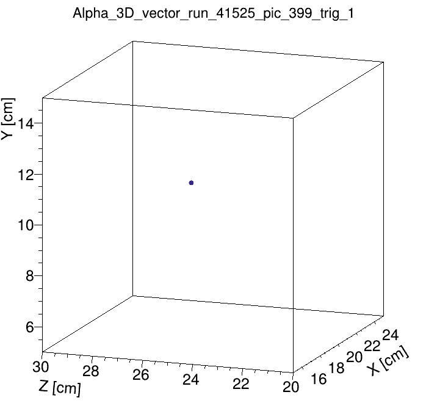

# CYGNO — 3D reconstruction and PMT‑CAM association

This repository contains the 3D alpha reconstruction and PMT–CAM association pipeline used in the CYGNO analyses. It combines camera-based cluster reconstruction (CAM) with PMT waveform analysis (BAT/PMT) and performs an event-by-event association to build a 3D description of alpha tracks.

The project focuses on:
- associating CAM clusters and PMT triggers,
- identifying alpha candidates independently in each sensor,
- building a merged 3D track description,
- **compute the 3D shape and direction of alpha particle tracks in CYGNO detectors.**

<div style="text-align:center">
  
</div>

***Author: David José Gaspar Marques (PhD)***

---

## Overview of the main program (Alpha_3D_LIME.cpp)

- Startup and inputs
  - Parse command-line mode (`full` or `debug`), CAM and PMT input ROOT files and output base name. `debug` enables verbose logging and forces `save_everything`.
  - Create output ROOT file and TTree.

- CAM (camera) processing
  - Iterate camera events, reconstruct clusters via the external CAM analyzer, compute barycenter/angle/profile and apply quick alpha selection cuts.
  - Save CAM candidates (track points, profile metrics) in memory for later association.

- PMT (waveform) processing
  - Read PMT waveforms, perform smoothing and extract features (TOT20/TOT30, peaks, skewness).
  - Run the external BAT fitter to extract PMT track parametrisation and a fitted luminosity when a candidate is found.

- Association and 3D building
  - Group CAM and PMT candidates per run/picture, compute pairwise average pointwise distances and perform one-to-one ranking.
  - For matched CAM - PMT pairs build a 3D track: XY from CAM, Z extent and direction from PMT, compute angles and full 3D length and direction.
- Output and cleanup
  - Write `AlphaEvents` TTree to the output ROOT file.

Notes / options:
- `mode=debug` runs a single debug event (if provided) and enables verbose plots: a folder is created in the output ROOT file with all the plots; 
- `full` analyze a full run file in batch processing;
- `save_everything = true` stores intermediate plots and graphs in the output file for inspection (default in `debug` mode, but can be used in `full` mode).

---

## Dependencies and important external repos (short)

Required: ROOT (6+), a C++11 toolchain and make.

External repos/tools required:

- The CYGNO PMT BAT fitter used to calculate the track's position in the CAM field of view from the PMT data. (https://github.com/davidjgmarques/BAT_PMTs)
  - A more updated version of this code exists, but has not been implemented yet.
  - The BAT toolkit must be installed (https://bat.mpp.mpg.de/)
- The CAM-reconstruction tools `CAM::Analyzer` (https://github.com/davidjgmarques/Track_analyzer)

These are two separate projects not maintained by me and must be available at compilation to run the 3D analysis. 

Modify the `Makefile` accordingly to use the correct paths, as well as the `Run BAT routine` in the main script to find the BAT executable.

---

## Example:

Start by running `make` from the main folder to create the `alpha_3d.out` executable.

An example data file is present in the `examples/data/` folder: `reco_run41525_3D.root`, which contains both CAM and PMT reconstructed data for run 41525.

Run the command: `./alpha_3d.out debug examples/data/reco_run41525_3D.root best_example 399`

The output can be found inside `/examples/`.

#### Terminal output:

```c++
./alpha_3d.out debug <path_to_file>reco_run41525_3D.root best_example 399

CAM Reco data file opened: reco_run41525_3D.root
PMT Reco data file opened: reco_run41525_3D.root

************   Analysis  CAMERA    ************

	==> Cam run: 41525; event: 399; cluster ID: 0


--> *The particle in this cluster was identified as an alpha: true

Track information: 

--> Estimated Z was: 51.0402 cm.
--> Position barycenter: x: 881.686; y: 1531.42
--> Quadrant: 1
--> Angle: 55.4461 degrees.
--> Length (cm): 5.39053


	==> Cam run: 41525; event: 399; cluster ID: 1


--> *The particle in this cluster was identified as an alpha: true

Track information: 

--> Estimated Z was: 13.0358 cm.
--> Position barycenter: x: 1174.94; y: 617.352
--> Quadrant: 3
--> Angle: -76.7983 degrees.
--> Length (cm): 5.52744


************   Analysis  PMT    ************


	==> PMT run: 41525; event: 399; trigger: 0; sampling: 1024


**PMT Track information: 

--> The TOT20/TOT30 ratios were: 1.05128 * 1.05556 * 1.05776 * 1.05396 * 
--> The TOT20 lengths were: 287 * 285 * 293 * 293 * 
--> The average number of peaks per waveform was: 0
--> The particle in this trigger was identified as an alpha: true
--> Moving towards the GEMs with score: 1.43979
--> The average travelled Z (cm) is: 2.11181
--> The track is in the quadrant: 1

Launching BAT script ...
../BAT_PMTs/./runfit.out -i bat_files/input_for_bat.txt -o bat_files/output_from_bat.txt -s 0 -e 10000 -m association > bat_files/bat_system_out.txt
-> Script executed successfully.


	==> PMT run: 41525; event: 399; trigger: 1; sampling: 1024


**PMT Track information: 

--> The TOT20/TOT30 ratios were: 1.0303 * 1.0297 * 1.04082 * 1.0404 * 
--> The TOT20 lengths were: 306 * 312 * 306 * 309 * 
--> The average number of peaks per waveform was: 0
--> The particle in this trigger was identified as an alpha: true
--> Moving towards the cathode with score: -1.3699
--> The average travelled Z (cm) is: 2.24858
--> The track is in the quadrant: 3

Launching BAT script ...
../BAT_PMTs/./runfit.out -i bat_files/input_for_bat.txt -o bat_files/output_from_bat.txt -s 0 -e 10000 -m association > bat_files/bat_system_out.txt
-> Script executed successfully.


************   COMBINED Analysis   ************


=> Total amount of alphas in the CAMERA: 2
=> Total amount of alphas in the PMT: 2

Associations for run 41525, picture 399
# CAM alphas: 2;  # PMT alphas: 2
==> We'll perform > 2 < associations.

---------------------------------------------------

*** Association # 1:

 -> CAM cluster = 0
 -> PMT trigger 0
 -> Distance: 43.0007

 ==> Event in run 41525, event 399, trigger 0, quadrant 1, with Alpha-PID = 1

... Testing for TTT sensor cut ...
--> This track *COULD* be cut, let's check...
begin Y: 21.6608
end Y: 25.6951
Track lowest Y: 21.6608
Track highest Y: 25.6951
Active row in cm: 15.3097
--> This track is *NOT* cut by the sensor!

  ** 3D Alpha track information: ** 

--> Position, X: 12.1996; Y: 21.6608
--> Travelled XY: 4.8788
--> Angle XY (#phi): 55.4461
--> Travelled Z: 2.11181
--> Direction in Z: 1 at 1.43979 score
--> Angle Z (#theta): 23.4056
--> Absolute Z: 51.0402
--> 3D alpha length (cm): 5.31624
--> WF TTT: 105.348
--> Transv. prof. (cm): 0.121284
--> Transv. prof. width (cm): 0.589

---------------------------------------------------

---------------------------------------------------

*** Association # 2:

 -> CAM cluster = 1
 -> PMT trigger 1
 -> Distance: 193.179

 ==> Event in run 41525, event 399, trigger 1, quadrant 3, with Alpha-PID = 1

... Testing for TTT sensor cut ...
--> This track is *NOT* cut by the sensor.

  ** 3D Alpha track information: ** 

--> Position, X: 17.7308; Y: 11.4756
--> Travelled XY: 3.92486
--> Angle XY (#phi): -76.7983
--> Travelled Z: 2.24858
--> Direction in Z: -1 at -1.3699 score
--> Angle Z (#theta): -29.8087
--> Absolute Z: 13.0358
--> 3D alpha length (cm): 4.52335
--> WF TTT: 262.793
--> Transv. prof. (cm): 0.0910332
--> Transv. prof. width (cm): 0.434

---------------------------------------------------
Time taken to run the script: 6.89976 seconds
**Finished**
```

---

## Final TTree — branches

#### General

| Branch name | Description |
|---|---|
| run | Run number for the event |
| picture | Picture / event identifier within the run |
| trigger | PMT trigger index associated with the entry |

#### Camera (CAM) quantities  

Some of these variables are inherited from the regular CYGNO CAM reco
(https://github.com/CYGNUS-RD/reconstruction)

| Branch name | Description |
|---|---|
| cam_energy | Integrated cluster signal measured by the camera |
| cam_nhits | Number of pixels (hits) that compose the cluster |
| cam_size | Cluster size as reported by CAM reco (unit as in CAM output) |
| cam_width | Transverse width of the cluster (cm) |
| cam_xmean, cam_ymean | Cluster centroid coordinates (cm)
| cam_rms | RMS of the transverse profile (pixels)
| cam_tgausssigma | Transverse Gaussian sigma from profile fit (CAM units)
| cam_latrms | Lateral RMS (CAM units)
| cam_t_prof_sigma | Transverse profile sigma converted to cm |
| cam_fit_quality | Fit quality for transverse profile (chi2/ndf)
| cam_t_prof_RMS | RMS of the transverse profile in cm |
| cam_t_prof_width | Width of the transverse profile in cm |
| absolute_Z | Diffusion-based absolute Z estimate (cm) from track's tranverse profile |
| cam_cutted_bool | Bool flag: cluster overlaps noisy/cut band in CAM |

#### PMT / BAT quantities

| Branch name | Description |
|---|---|
| pmt_energy | Energy / fitted luminosity returned by the BAT fit |
| pmt_peaks | Average number of peaks per PMT waveform |
| pmt_direction | Head-tail sign determined from Bragg peak skewness (-1,0,1) |
| pmt_direction_score | Numeric score supporting the head-tail decision |
| pmt_quad | PMT quadrant index determined from integrals |

#### 3D track (combined)

| Branch name | Description |
|---|---|
| begin_X, begin_Y, begin_Z | Track start coordinates in detector units (cm)
| track_end_X, track_end_Y, track_end_Z | Track end coordinates (cm)
| Z_angle | Polar angle (theta) in degrees computed from Z vs XY projection |
| XY_angle | In-plane angle (phi) in degrees from the CAM::analyzer |
| Z_length | Projected Z extent (cm) derived from PMT analysis |
| XY_length | Projected XY length (cm) measured from CAM:analyzer track points |
| full_length | 3D track length combining XY and Z components |

#### Association & diagnostics

| Branch name | Description |
|---|---|
| cam_quad | Camera quadrant index for the CAM cluster |
| cam_ParticleID, pmt_ParticleID | Per-sensor alpha PID flags (CAM / PMT) |
| distances | Vector of per-point BAT–CAM distances used to assess match quality |
| cut_ttt_sensor | Bool: track overlaps the TTT sensor cut region |

#### Metadata

| Branch name | Description |
|---|---|
| git_commit_hash | Git commit hash recorded in the file (40-char C-string) |

---

## Feedback

Suggestions and improvements are welcome. For questions or to report issues contact the author at: david.jose.gaspar.marques@cern.ch


